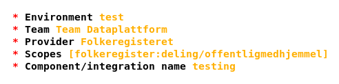

# Public registers

Commands related to accessing public registers are grouped under the `pubreg`
command prefix. Run the following command to see a list of all available
`pubreg` commands:

```sh
okdata pubreg -h
```

Contents:
* [Prerequisites](#prerequisites)
* [Creating a client](#creating-a-client)
* [Listing clients](#listing-clients)
* [Deleting a client](#deleting-a-client)
* [Creating a client key](#creating-a-client-key)
* [Rotating a client key](#rotating-a-client-key)
* [Listing client keys](#listing-client-keys)
* [Deleting a client key](#deleting-a-client-key)
* [Viewing a client's audit log](#viewing-a-clients-audit-log)

## Prerequisites

Make sure you've got the right legal basis before accessing public registry
data. Read more about this in our [guidelines for accessing public
registers](https://github.com/oslokommune/dataplattform/blob/master/origo/registerdata/offentlige-registerdata.md).

## Creating a client

The following command launches a step-by-step wizard to create a new client for
accessing a public register:

```sh
okdata pubreg create-client
```

Example values from the wizard:



## Listing clients

Use the following command to display a table of all of your clients:

```sh
okdata pubreg list-clients
```

## Deleting a client

When a client is no longer needed, it should be deleted by using the following
command:

```sh
okdata pubreg delete-client
```

Clients with active keys cannot be deleted. In such cases, their keys have to be
[deleted](#deleting-a-client-key) first.

Note that client deletion is irreversible.

## Creating a client key

Before creating client keys, you may want to grant a service user from the
dataplatform access to your AWS account's Parameter Store by following [these
steps](https://github.com/oslokommune/dataplattform/blob/master/origo/registerdata/offentlige-registerdata-3.md#%C3%A5pne-aws-konto). This
must be done if you want us to add and remove keys directly in your AWS
environment. It's also possible to generate keys locally and handle them
yourselves, if you prefer that.

The following command can be used to launch a step-by-step wizard to create a
new client key:

```sh
okdata pubreg create-key
```

Note that due to how Maskinporten works, the expiration date of every existing
key will be updated to today's date when creating a new key. Digdir is looking
into a fix for this issue.

Each client can hold a maximum of five keys. After reaching that limit, old keys
have to be [deleted](#deleting-a-client-key) to make room for new ones.

## Rotating a client key

Client keys last a year, but you're encourage to rotate them more often than
that. To rotate a key, start by [creating](#creating-a-client-key) a new key. If
you opt to automatically send it to your AWS account's Parameter Store, the
newly generated key will replace the old one in place (i.e. the old one will be
overwritten). If you opt to download the key locally, you'll have to replace the
old key yourself.

After the new key has been installed, the old key can safely be
[deleted](#deleting-a-client-key).

## Listing client keys

Use the following command to display a table of all the keys registered on one
of your clients:

```sh
okdata pubreg list-keys
```

## Deleting a client key

When a key is no longer needed, it should be deleted by using the following
command:

```sh
okdata pubreg delete-key
```

Note that key deletion is irreversible.

Also note that due to how Maskinporten works, the expiration date of every
existing key will be updated to today's date when creating a new key. Digdir is
looking into a fix for this issue.

## Viewing a client's audit log

To view the audit log for a client, use the following command:

```sh
okdata pubreg audit-log
```

Audit logs contain the history of events related to clients, including their
creation time, when keys are added and deleted, and the username of the user who
performed each action.

Note that audit logs for deleted clients can't be retrieved this way. Should
that become necessary, please contact Dataspeilet.
